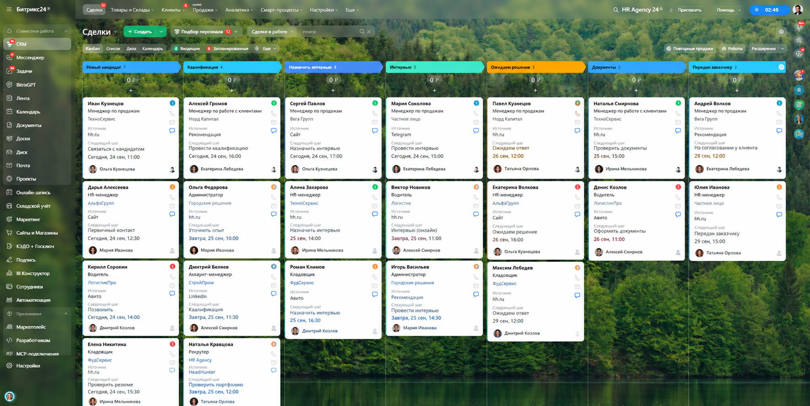

# Bitrix24 Quick Setup



**Автоматическая подготовка Bitrix24 через REST API.**

Проект нужен для того, чтобы не настраивать тестовый портал вручную перед каждой демонстрацией, тестовым заданием или проверкой интеграции.

Скрипт подключается к Bitrix24 через входящий webhook, проверяет доступ и подготавливает CRM под заданный сценарий: структуру, воронку, этапы, поля карточки сделки и тестовые данные.

## Что автоматизируется

### Подключение

Проверка REST API и текущего пользователя портала:

```bash
python main.py check
```

### Подготовка CRM

Команда `setup` автоматически:

- создаёт подразделение «Подбор персонала», если его ещё нет;
- создаёт воронку «Подбор персонала»;
- настраивает этапы воронки;
- удаляет устаревшие этапы после переноса связанных сделок;
- создаёт и обновляет пользовательские поля сделок;
- настраивает карточку сделки.

Основная рабочая цепочка:

```
Новый кандидат
      ↓
Квалификация
      ↓
Интервью
      ↓
Ожидаем решение
      ↓
Документы
      ↓
Передан заказчику
      ↓
Выход на работу / Отказ
```

Запуск:

```bash
python main.py setup
```

Скрипт рассчитан на повторный запуск: существующие сущности переиспользуются, а недостающие настройки добавляются.

## Тестовые данные

После настройки можно создать набор синтетических кандидатов и сделок:

```bash
python main.py demo
```

Количество записей можно указать отдельно:

```bash
python main.py demo-new 30
```

Также есть команды для очистки демо-данных и восстановления тестового состояния:

```bash
python main.py demo-clear
python main.py restore-test
```

Дополнительные сценарии:

```bash
python main.py sla-demo
python main.py inspect
```

## Зачем это нужно

Без автоматизации подготовка демо-портала превращается в ручную работу:

- создать воронку;
- добавить этапы;
- создать десятки CRM-полей;
- настроить карточку;
- подготовить тестовые сделки;
- привести портал к нужному состоянию перед презентацией.

Quick Setup превращает это в воспроизводимый сценарий.

**Один запуск → готовый портал для работы или демонстрации.**

## Архитектура

Проект построен вокруг небольшого REST-клиента Bitrix24:

```
main.py
   │
   ├── setup.py ─────── настройка CRM
   │       ├── воронка
   │       ├── этапы
   │       ├── поля
   │       └── карточка сделки
   │
   ├── demo.py ──────── тестовые данные
   ├── restore.py ───── восстановление
   └── sla_demo.py ──── сценарий SLA
           │
           ▼
      BitrixClient
           │
           ▼
     Bitrix24 REST API
```

REST-вызовы инкапсулированы в `BitrixClient`. Это позволяет использовать единый слой для проверки подключения, чтения данных и изменения CRM.

## Структура проекта

```
bitrix24-quick-setup/
│
├── main.py               # CLI-команды
├── bitrix.py             # REST-клиент Bitrix24
├── config.py             # конфигурация
├── schema.py             # описание CRM-полей
├── setup.py              # подготовка портала
├── demo.py               # генерация тестовых данных
├── restore.py             # восстановление
├── sla_demo.py            # сценарий SLA
├── ai_position_demo.py    # AI-сценарий определения позиции
├── staffflow_simulator.py # симуляция сценария подбора
├── requirements.txt
└── .env.example
```

Некоторые demo-скрипты находятся в этом же репозитории, потому что Quick Setup использовался как рабочая площадка для подготовки и демонстрации сценариев Bitrix24.

## Установка

Скопировать пример конфигурации:

```bash
cp .env.example .env
```

Указать входящий webhook Bitrix24:

```env
BITRIX_WEBHOOK=...
```

Установить зависимости:

```bash
pip install -r requirements.txt
```

Проверить подключение:

```bash
python main.py check
```

Подготовить портал:

```bash
python main.py setup
```

## Безопасность

Секреты не хранятся в репозитории.

- `.env` добавлен в `.gitignore`;
- в репозитории используется только `.env.example`;
- тестовые данные должны быть синтетическими;
- реальные credentials и персональные данные в Git не добавляются.

## Связь с другими проектами

Quick Setup — базовый слой подготовки Bitrix24.

На его основе были подготовлены отдельные портфолио-проекты:

- **Bitrix24 Connector** — интеграция внешних сообщений, Open Lines, CRM и AI;
- **Bitrix24 Demo Stand** — воспроизводимый демонстрационный сценарий для презентации решения.

Quick Setup отвечает именно за **подготовку самого портала**.

## Статус

**Рабочий проект.**

Используется для автоматической подготовки Bitrix24 к тестированию, демонстрациям и сценариям интеграции.
